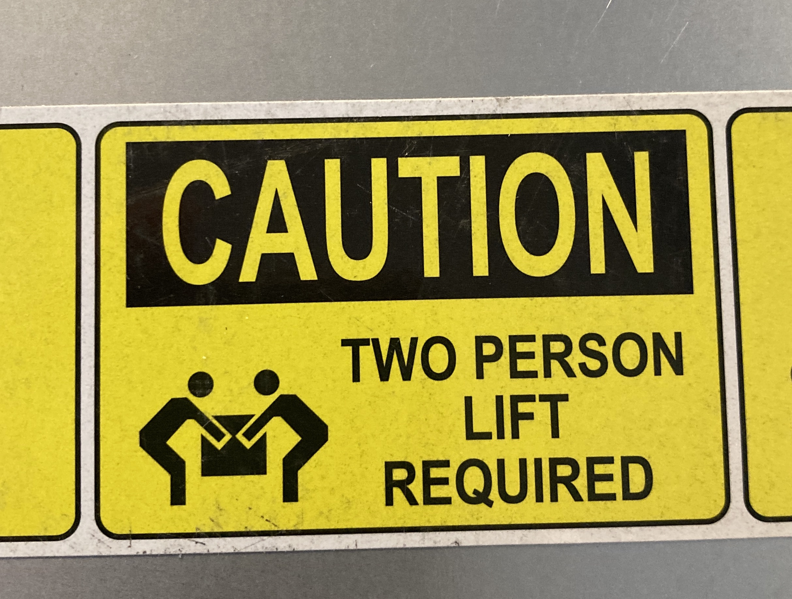
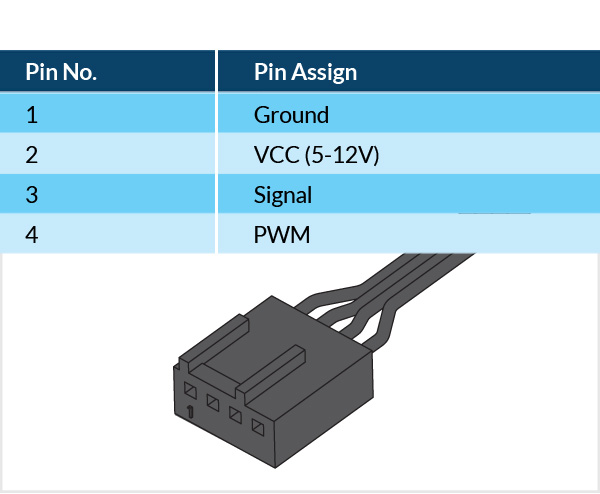
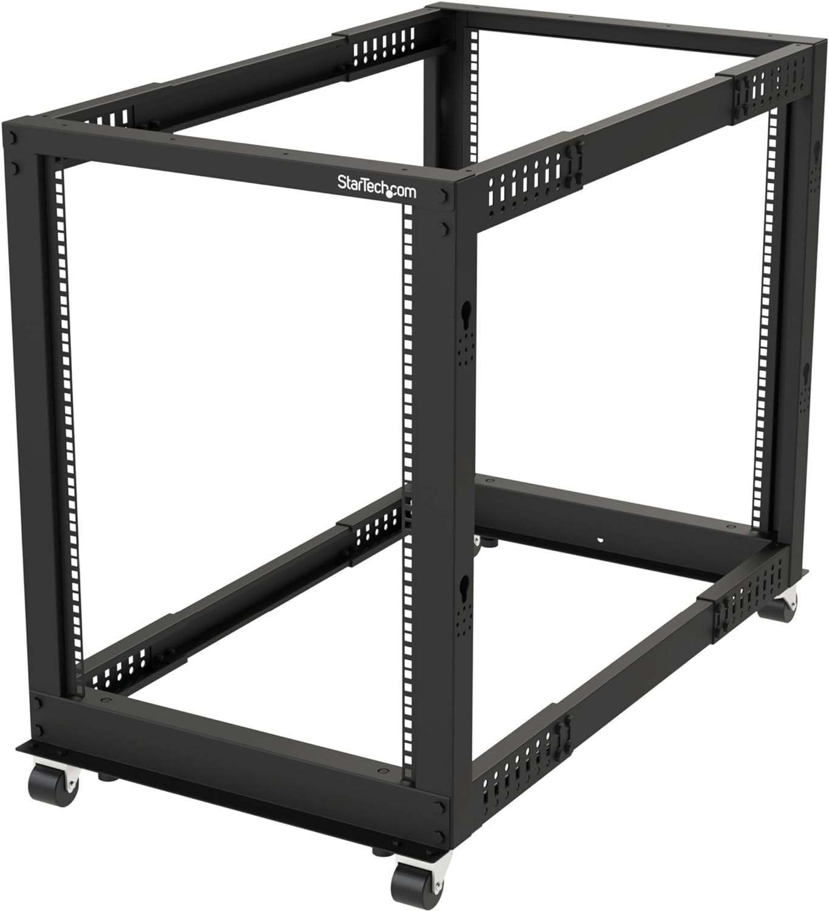

# Home Lab

The bare metal in my basement   

## The Platform

To build the 2024 version of my home lab I got a used [Gigabyte G292-Z20 HPC/AI Server](https://www.gigabyte.com/Enterprise/GPU-Server/G292-Z20-rev-100) through eBay.  

This is basically a data center server intended for AI workloads; for those who regularly work with AWS, this is roughly the equivalent to the hardware behind the [Amazon EC2 G4dn Instances](https://aws.amazon.com/ec2/instance-types/g4/).  

I purchased it without the GPUs (it can accommodate 8x double slot Nvidia T4 or V100 cards), but it is still ridiculously overpowered (24 core CPU, 8 channel 512GB DDR4 ECC2 memory, two 2.2 kW power supplies, two 10GbE network connections etc).  

I assume the price was 'right' because majority of the business workloads these days are running on A10 or A100 GPUs, so a server that was designed for the Volta/Turning architectures is somewhat passé for enterprises and who else would be crazy enough to purchase something like this right?

## Challenges

Why this is generally a bad idea and PITA.  

If your only goal is to play with large AI models at home, then as of early-2024 a Threadripper-based workstation (or perhaps a beefy M2/M3-based Mac) would be a much better, although more expensive idea.  

* **Physical Dimensions:** this thing is huge (and heavy); in order to accommodate the 8 GPUs the case is over 80 cm deep, which means finding (and transporting) a cheap rack for it is not easy.  
  

* **Noise Levels:** Unmodified, the fans generate [noise levels](https://audiology-web.s3.amazonaws.com/migrated/NoiseChart_Poster-%208.5x11.pdf_5399b289427535.32730330.pdf) close to 100 dB during boot, certainly not suitable for residential environments.
 

## Let's Mod It

### The Fans

There are no words to describe how insane the [stock fans](https://www.delta-fan.com/technology/three-phase-fan/pfm0812he-01bfy.html) are. They literarily SCREAM and draw over 4 amps each at max speed...and there are 8 of them.  

The first thing I did was obviously adjust the fan curves in the management console and enable the [ErP Lot 9](https://www.eceee.org/ecodesign/products/enterprise-servers/) mode in the BIOS (which, among other things, puts the 2nd power supply into cold standby at low loads). This helped getting the noise down to a bearable 60 dB at idle, but it was still very distracting.

At first I was thinking of replacing the stock fans with some Noctua fans and call it a day, however let's compare some specs here (all 80mm 12V fans):  

| type | Static Pressure | Air Flow | Noise (dB) | min RPM | max RPM
|------|------|------|------|-----|-----|
| Delta (stock) | 126.22 mm H₂O | 3.67 m³/min | 77.0 dB | 3000 | 16300 
| Noctua NF-A8-PWM | 2.37 mm H₂O | 0.93 m³/min | 17,7 dB | 450 | 2200 

Since I don't want to gut the cooling capabilities of the system entirely, I can't go with Noctua, which are silent, but don't move much air in exchange.  

I decided to try and optimize the idle fan speed instead, since the stock fans don't go below 3000 RPM.  
  
This is how I found Arctic's 10k server fans. Arctic doesn't seem to disclose noise levels (apart from the fans being 'quiet'), however they have reasonable static pressure and air flow performance and can spin as slow as 500 RPM.  

| type | Static Pressure | Air Flow | Noise (dB) | min RPM | max RPM
|------|------|------|------|-----|-----|
| ARCTIC S8038-10K | 51 mm H₂O | 2.89 m³/h | ? | 500 | 10000

Only later did I learn that while the Arctic fans can spin as slow as 500 RPM, the warning thresholds in BIOS will reset to 1500 (non-critical) / 1250 (critical) after a reboot, which means the fan controller will try to compensate the delinquent slow spinning fans by spinning everything up to max speed temporarily. I decided to set the fan curves to 15% at idle, 1650 RPM.  
Not great, not terrible.  

The next challenge was connecting the new fans as the fan header is not a standard PC header.

It looks like a 7 pin Molex connector, with 6 leads connected, while 4 wires leading to fan.  
The pinout of the original fan was available on the manufacturer's site.
  
Based on this I assume the extra black and red wires are just there to ensure the connector can deliver the amperage needed by the fan.  

For reference, the pinout of the Arctic (or any normal PC fan):  
  

Since I didn't have a 7 pin Molex connector or the proper crimping tool (and I didn't want to cut the connectors off the original fans just yet), I worked on the rack while I waited for the connectors to arrive.  

### The Rack
The cheapest suitable rack I found that I didn't need to rent a truck to transport was StarTech's open frame server rack line. It looks deceptively timid on marketing photos, but it has excellent build quality. However the fact that this was an open frame rack didn't help the noise level situation.  

While waiting for the fan connectors to arrive, I decided to take some unorthodox and perhaps drastic action and glue some acoustic foam to MDF plates and hang these improvised 'acoustic panels' on two sides and the top of the rack.  

Both MDF and the foam have excellent acoustic properties, but both do accumulate static electricity and they both do shed some dust particles. So, yea not ideal for computers.  

The static charge seem to be dissipated by the metal rack, the rack is grounded, the server is also grounded and enclosed, so not an immediate concern.  

**The three panels (so not complete enclosure), got me approximately 10-12 dB decrease in noise levels**, so halved the perceived noise.

### Finally, After a Lot of Crimping

Once I crimped new connectors on the Arctic fans (for future reference, [Molex 22013077](https://www.molex.com/en-us/products/part-detail/22013077)) the noise levels decreased to the final 39 dB at idle (quiet library) and 55 dB during boot (dishwasher).  
In exchange the CPU is running approximately 10C higher temperatures during Mixtral CPU inference (75C instead of 65C), which is still acceptable.  

This is not the best possible result as

* I didn't attempt to replace the power supply fans; as per the Internet lot of people try this and fail (these server PSU fans spin at constant speeds and if the fan is underpowered the PSU will slowly cook itself)
* I haven't done anything comprehensive in terms of front and back covers (just the 10U height haphazard front covers visible on the above image); obviously most of the noise is escaping through the back...

The PSU fans tend to change pitch for some reason (perhaps showing their age) and at high fan RPMs the case resonates (even with dampeners) so the work will need to continue...  

## Power Draw

"But Josef, what about your electricity bill?!" asked a colleague when learning about the dual 2.2 kW power supplies.  
As per the management console the system (without GPUs) is drawing between 175 to 200 watts idle, 300 to 325 watts under load.  

